# CFL Backend - Complete ERD Diagram (All Tables & Connections)

> [!NOTE]
> This ERD covers **33 database tables** found from `@Entity` annotated classes. Relationships shown include both **JPA-level** (solid) and **business-logic level** (via empId/email matching in services).

---

## Mermaid ERD Diagram

```mermaid
erDiagram

    register_user {
        Long userId PK
        String userName
        String userPassword
        boolean status
        Role role
    }

    refresh {
        Long tokenId PK
        String refreshToken
        Instant expiry
        Long user_id FK
    }

    cfl_table {
        Long id PK
        Long empId
        String cflFirstName
        String cflMiddleName
        String cflLastName
        String joiningDate
        String subArea
        String cflDesignation
        String cflDepartment
        String cflProject
        String cflDepartmentDescription
        String cflSubDepartment
        String cflSubDeptDescription
        String cflProjectClassification
        String buHeadName
        String cflEmail
        String contact
        String gender
        String category
        String vertical
        String cflLocation
        String year
        String sscResult
        String hscResult
        String underGraduateResult
        String postGraduateResult
        String collegeName
        String collegeBranch
        String technicalSkills
        String nonTechnicalSkills
        String fileName
        byte fileData
        String mentorName
        String mentorEmail
        String mentorDepartment
        String mentorLocation
        String mentorDesignation
        String reportingManager
        String reportingManagerMail
        String managerDepartment
        String managerLocation
        String managerDesignation
        Long hrId
        String hrName
        String hrMail
        String hrLocation
        String emailAcceptance
        String emailDeclined
        Boolean goalSettingStatusHrToMgr
        Boolean goalSettingReviewStatusHrToMgr
        Boolean probationStatus
        Boolean cflMgrQuarterStatus
        String otp
        LocalDate extendedMentoringDate
        LocalDate hrMeetingExtendedDate
        LocalDate managerMeetingExtendedDate
        LocalDate extendedDate
        LocalDate goalSettingReviewExtendedDate
        LocalDate extendedProbationDate
        String cflScreenTime
        LocalDate probationDate
        String managerChange
        String mentorChange
        String projectChange
        String locationChange
        String departmentChange
    }

    mentor_table {
        Long id PK
        Long mentorId
        String mentorName
        String mentorEmail
        String mentorDepartment
        String mentorLocation
        String mentorDesignation
        String mentorFileName
        byte mentorFileData
        String otp
        String mentorScreenTime
    }

    manager_table {
        Long id PK
        Long managerId
        String managerName
        String managerEmail
        String managerDepartment
        String managerLocation
        String managerDesignation
        String managerFileName
        byte managerFileData
        String otp
        String managerScreenTime
    }

    hr_table {
        Long id PK
        Long hrId
        String hrName
        String hrEmail
        String hrLocation
        String hrFileName
        byte hrFileData
        String otp
        String hrScreenTime
    }

    exit {
        Long id PK
        Long empId FK
        String cflFirstName
        String cflLastName
        String cflEmail
        String joiningDate
        String cflDesignation
        String cflDepartment
        String reportingManager
        String reportingManagerMail
        String exitDate
        String relievingDate
        String comments
        String declineReason
        String extendedDate
        String extendedReason
        String status
        String acceptStatus
    }

    probation_confirmation {
        Long id PK
        Long employeeCode FK
        String employeeName
        String designation
        String location
        String department
        String project
        String dateOfJoining
        String dateOfConfirmation
        String dropdown1_to_20
        String remark3
        String remark6
        String confirmation
        String reportingManagerName
        String reportingManagerSignature
        String buHeadName
        String buHeadSignature
        String hrRepresentativeName
        String hrRepresentativeSignature
        String status
        Long year
    }

    certification_table {
        Long Id PK
        Long empId FK
        LocalDate date
        LocalTime time
        String certificateFileName
        byte certificateFileData
    }

    logbook_table {
        Long Id PK
        Long empId FK
        LocalDate date
        LocalTime time
        String logBookFileName
        byte logBookFileData
    }

    resume_table {
        Long Id PK
        Long empId FK
        LocalDate date
        LocalTime time
        String resumeFileName
        byte resumeFileData
    }

    goal_setting_tracker {
        Long id PK
        Long cflId FK
        Boolean goalInitiatedFromHrToManager
        Boolean responseSendByManagerToCfl
        Boolean responseSendByManagerToHr
        String quarter
        String cflName
        Long year
    }

    probation_tracker {
        Long id PK
        Long cflId FK
        Boolean probationInitiatedFromHrToManager
        Boolean responseSendByManagerToCfl
        Boolean responseSendByManagerToHr
    }

    thirty_days_goals {
        Long Id PK
        Long empId FK
        Long year
        String goal
        String deliverable
        String status
        String weightage
        String quarter
    }

    sixty_days_goals {
        Long Id PK
        Long empId FK
        Long year
        String goal
        String deliverable
        String status
        String weightage
        String quarter
    }

    ninety_days_goals {
        Long Id PK
        Long empId FK
        Long year
        String goal
        String deliverable
        String status
        String weightage
        String quarter
    }

    cfl_skill {
        Long id PK
        Long empId FK
        Long year
        String primarySkills
        String secondarySkills
        String otherSkills
        String quarter
    }

    question_radio {
        Long id PK
        Long empId FK
        String question1_to_5
        String quarter
        Long year
    }

    manager_rating {
        Long Id PK
        Long empId FK
        String talentLevel
        String potentialLevel
        String performanceLevel
        String annual
        Long year
    }

    manager_rating_question_and_answer {
        Long id PK
        Long empId FK
        String questionAnswerText1_to_5
        String annual
    }

    mentee_to_mentor_feed_back {
        Long Id PK
        Long menteeId FK
        String feedbackMessage
        LocalDate feedbackDate
        Long year
    }

    mentor_to_mentee_feed_back {
        Long Id PK
        Long menteeId FK
        String menteeName
        String mentorName
        String mentorEmail
        String feedbackMessage
        LocalDate feedbackDate
        Long year
    }

    manager_to_cfl_feed_back {
        Long Id PK
        Long menteeId FK
        String menteeName
        String managerName
        String managerEmail
        String feedbackMessage
        LocalDate feedbackDate
        Long year
    }

    quiz_test {
        Long id PK
        String question
        String option1_to_4
        String answer
        String topic
        String fromDate
        String toDate
        String examDuration
    }

    quiz_result {
        Long id PK
        Long cflId FK
        String name
        Long score
        String topic
    }

    cfl_roles {
        Long id PK
        String roleName
        Long year
    }

    rewards_and_recognition {
        Long id PK
        String rewardsPersonName
        String messagedPersonName
        String message
        String rewardImageName
        byte rewardImage
        LocalDate date
        String rewardRecognitionType
    }

    cfl_memories {
        Long id PK
        String fileName
        byte fileData
        Long year
    }

    video_table {
        Long videoId PK
        String videoLink
        String year
    }

    lateral_shift {
        Long Id PK
        Long empId FK
        String internal1_to_3
        String project1_to_3
        String skillGap
        String backUp
        String backUpForWhom
        Long year
    }

    mail_history {
        Long id PK
        Long empId FK
        LocalDate mailDate
        LocalTime mailTime
    }

    annual_appraisal_info {
        Long id PK
        Long empId FK
        String empName
        Long year
    }

    user_manual_table {
        Long Id PK
        String userManualFileName
        byte userManualFileData
    }

    %% ===== RELATIONSHIPS =====

    %% JPA-level (OneToOne)
    register_user ||--o| refresh : "has"

    %% CFL is the central entity - created with Mentor, Manager, HR
    cfl_table ||--o{ mentor_table : "assigned mentor via mentorEmail"
    cfl_table ||--o{ manager_table : "assigned manager via managerEmail"
    cfl_table ||--o{ hr_table : "assigned HR via hrMail"

    %% CFL child tables (via empId)
    cfl_table ||--o{ certification_table : "empId"
    cfl_table ||--o{ logbook_table : "empId"
    cfl_table ||--o{ resume_table : "empId"
    cfl_table ||--o{ thirty_days_goals : "empId"
    cfl_table ||--o{ sixty_days_goals : "empId"
    cfl_table ||--o{ ninety_days_goals : "empId"
    cfl_table ||--o{ cfl_skill : "empId"
    cfl_table ||--o{ question_radio : "empId"
    cfl_table ||--o{ manager_rating : "empId"
    cfl_table ||--o{ manager_rating_question_and_answer : "empId"
    cfl_table ||--o{ lateral_shift : "empId"
    cfl_table ||--o{ mail_history : "empId"
    cfl_table ||--o{ annual_appraisal_info : "empId"
    cfl_table ||--o| exit : "empId"
    cfl_table ||--o| probation_confirmation : "employeeCode"

    %% CFL tracker tables (via cflId = empId)
    cfl_table ||--o{ goal_setting_tracker : "cflId"
    cfl_table ||--o| probation_tracker : "cflId"

    %% Feedback tables
    cfl_table ||--o{ mentee_to_mentor_feed_back : "menteeId"
    cfl_table ||--o{ mentor_to_mentee_feed_back : "menteeId"
    cfl_table ||--o{ manager_to_cfl_feed_back : "menteeId"
    mentor_table ||--o{ mentor_to_mentee_feed_back : "mentorEmail"
    manager_table ||--o{ manager_to_cfl_feed_back : "managerEmail"

    %% Quiz
    cfl_table ||--o{ quiz_result : "cflId"
    quiz_test ||--o{ quiz_result : "topic"

    %% Rewards references CFL via rewardsPersonName containing empId
    cfl_table ||--o{ rewards_and_recognition : "empId in rewardsPersonName"
```

---

## Relationship Summary Table

| # | Source Table | Target Table | Link Column | Type | Notes |
|---|-------------|-------------|-------------|------|-------|
| 1 | `register_user` | `refresh` | `user_id` | **OneToOne (JPA)** | Only explicit JPA FK |
| 2 | `cfl_table` | `mentor_table` | `mentorEmail` | Business Logic | Created when CFL is created |
| 3 | `cfl_table` | `manager_table` | `reportingManagerMail` | Business Logic | Created when CFL is created |
| 4 | `cfl_table` | `hr_table` | `hrMail` | Business Logic | Created when CFL is created |
| 5 | `cfl_table` | `certification_table` | `empId` | Business Logic | CFL uploads certificates |
| 6 | `cfl_table` | `logbook_table` | `empId` | Business Logic | CFL uploads logbooks |
| 7 | `cfl_table` | `resume_table` | `empId` | Business Logic | CFL uploads resumes |
| 8 | `cfl_table` | `thirty_days_goals` | `empId` | Business Logic | Goal setting (30 days) |
| 9 | `cfl_table` | `sixty_days_goals` | `empId` | Business Logic | Goal setting (60 days) |
| 10 | `cfl_table` | `ninety_days_goals` | `empId` | Business Logic | Goal setting (90 days) |
| 11 | `cfl_table` | `cfl_skill` | `empId` | Business Logic | Skills per quarter |
| 12 | `cfl_table` | `question_radio` | `empId` | Business Logic | Appraisal questions |
| 13 | `cfl_table` | `manager_rating` | `empId` | Business Logic | Manager rates CFL |
| 14 | `cfl_table` | `manager_rating_question_and_answer` | `empId` | Business Logic | Annual Q&A |
| 15 | `cfl_table` | `lateral_shift` | `empId` | Business Logic | Lateral movement |
| 16 | `cfl_table` | `mail_history` | `empId` | Business Logic | Email tracking |
| 17 | `cfl_table` | `annual_appraisal_info` | `empId` | Business Logic | Annual appraisal |
| 18 | `cfl_table` | `exit` | `empId` | Business Logic | Exit management |
| 19 | `cfl_table` | `probation_confirmation` | `employeeCode` | Business Logic | Probation form |
| 20 | `cfl_table` | `goal_setting_tracker` | `cflId` | Business Logic | Goal tracker |
| 21 | `cfl_table` | `probation_tracker` | `cflId` | Business Logic | Probation tracker |
| 22 | `cfl_table` | `mentee_to_mentor_feed_back` | `menteeId` | Business Logic | CFL gives feedback to mentor |
| 23 | `cfl_table` | `mentor_to_mentee_feed_back` | `menteeId` | Business Logic | Mentor gives feedback to CFL |
| 24 | `cfl_table` | `manager_to_cfl_feed_back` | `menteeId` | Business Logic | Manager gives feedback to CFL |
| 25 | `mentor_table` | `mentor_to_mentee_feed_back` | `mentorEmail` | Business Logic | Mentor identified by email |
| 26 | `manager_table` | `manager_to_cfl_feed_back` | `managerEmail` | Business Logic | Manager identified by email |
| 27 | `cfl_table` | `quiz_result` | `cflId` | Business Logic | Quiz scores |
| 28 | `quiz_test` | `quiz_result` | `topic` | Business Logic | Quiz linked by topic |
| 29 | `cfl_table` | `rewards_and_recognition` | `empId` | Business Logic | empId stored in name field |

### Standalone Tables (No Direct FK Relationships)
| Table | Purpose |
|-------|---------|
| `cfl_roles` | Stores CFL role definitions per year |
| `cfl_memories` | Photo gallery per year |
| `video_table` | Training video links per year |
| `user_manual_table` | User manual PDF storage |
| `quiz_test` | Quiz question bank (linked to quiz_result via topic) |
